*By Adrian Png*

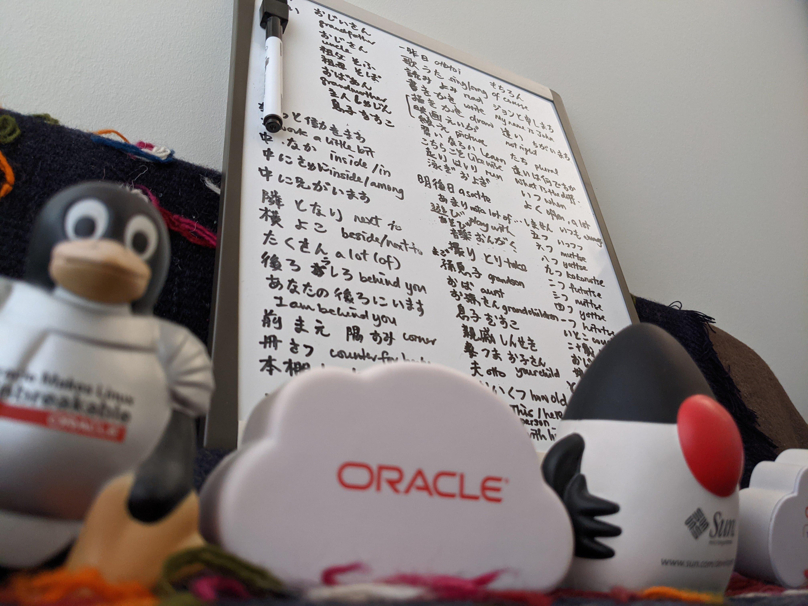

こにちわ！

Have you always wanted to learn a new language and be introduced to a new and different culture? I have, and for the last six months, I have been using [Duolingo](https://www.duolingo.com/) to get an introduction to the Japanese language. Among the seven secrets recommended by [TED](http://www.ted.com/) translators in this [blog post](https://blog.ted.com/how-to-learn-a-new-language-7-secrets-from-ted-translators/), the general consensus seems to be integrating the language in your daily lives.

## Background

Since I started learning the language, I have been exposed to many new words. However, they remain in my memory, only as long as I keep using them in my daily conversations, or at very least, reading them on a regular basis. My wife has a habit of scribbling on pieces of paper, filling them with words that she had learned. Thinking that we could keep them tidy in one spot, we purchased a small whiteboard where she could write them in erasable ink. Not surprisingly, it filled up quickly and became harder each day to decide what to keep or erase, as our vocabulary increased.

[Flashcards](https://wikipedia.org/wiki/Flashcard) are a commonly used tool to aid memorizing new concepts and terms and are a promising replacement. These days, there are many applications available on mobile devices and computers for creating flashcards. However, we wanted the words to be flashed constantly and the device needed to be placed in a common area that we frequented. That would be the kitchen!

It didn't make sense to devote a mobile device for a single purpose and they were probably too expensive in cost and power consumption. Furthermore, we would have had to invest in a special mount to hold the device in place, unobtrusively. A fridge magnet would have been perfect!

As a gadget freak, I had acquired a wide range of electronic components over the years. More recently, I have been intrigued by a low-powered, small-form factor [Microcontroller Unit](https://wikipedia.org/wiki/Microcontroller) (MCU), manufactured by [Espressif](https://www.espressif.com/). The chip I am referring to is the [ESP32](https://www.espressif.com/en/products/socs/esp32). Out of the box, the device comes with WiFi and Bluetooth support and only required minimal amount of power to run.

To build one though, I would need to source the right parts and possibly custom 3D-print the enclosure like I did a few years ago when I created my own [e-badge](https://twitter.com/fuzziebrain/status/1141135537308225537) for the annual [ODTUG](https://www.odtug.com) Kscope conference. Fortunately, the clever folks at [M5Stack](https://m5stack.com/) came up with a 4.7 inch [e-ink](https://wikipedia.org/wiki/Electronic_paper) device that more than met my requirements.

The [M5Paper](https://m5stack.com/collections/m5stack-new-arrival/products/m5paper-esp32-development-kit-960x540-4-7-eink-display-235-ppi) is powered by a variant of the ESP32 chip and comes with all the ingredients I needed for this project. As mentioned earlier, the ESP32 comes with WiFi support and a sizable amount of memory (for an embedded device), built-in magnet, a self-contained power supply, and a MicroSD card slot. As a bonus, I also had access to a built-in RTC (real-time clock), temperature and humidity sensor, buttons and a touch screen for interactivity and three expansion slots to further extend my application. This was the perfect device for my APEX Language Learner!

## Objective

Before starting out to build the solution, I had in mind the following goals:

1. Create an easy to use web application to manage a repository of Japanese characters, [Romaji](https://wikipedia.org/wiki/Romanization_of_Japanese) to aid pronunciation for an English speaker, and of course, the English translation of the word or sentence.
1. Create a web service that returns a random word.
1. Display the random word on the M5Paper.

Here's what it looks like upon completion:

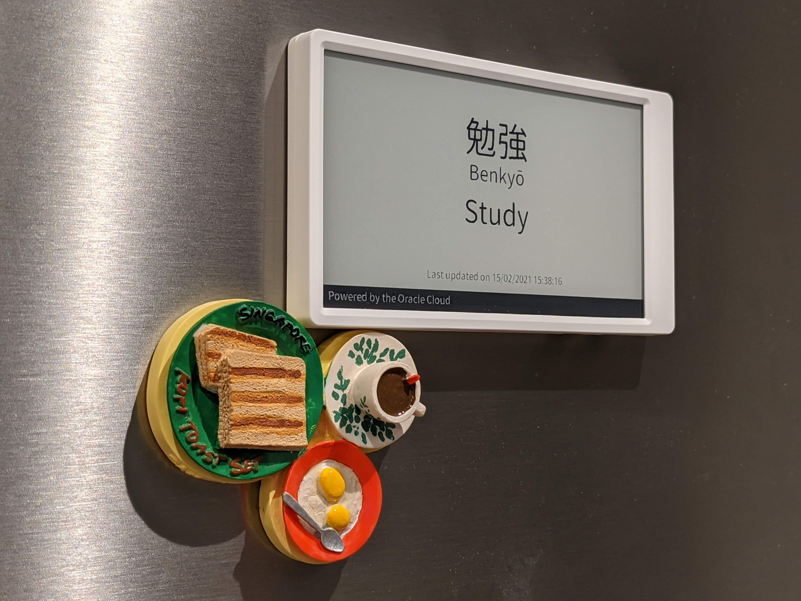

All that in a weekend of fun!

## Toolkit

To achieve my goals, here are the ingredients I used:

* 01x M5Stack M5Paper ESP32 Development Kit
* 01x MicroSD card
* 01x [Oracle Cloud Free Tier](https://www.oracle.com/cloud/free) account
* 01x Oracle Always Free [Autonomous Database](https://www.oracle.com/autonomous-database/) (ADB)
* [Oracle Application Express](https://apex.oracle.com) (APEX, pre-installed with the ADB)
* [Oracle REST Data Services](https://www.oracle.com/ca-en/database/technologies/appdev/rest.html) (ORDS, pre-installed with the ADB)

### Oracle Cloud Free Tier Resources

The Oracle Cloud Free Tier account offers a suite of resources offered by Oracle at no charge and no time limits. Yes, you read that correctly! Inside the bag of free resources, you will find not one, but two Always Free Autonomous Databases! There are many great reads on how to get started setting up your Oracle Cloud account and creating your first ADB, including this [piece](https://blogs.oracle.com/developers/launching-your-first-free-autonomous-db-instance) by [Todd Sharp](https://twitter.com/recursivecodes).

[Luc Demanche](https://twitter.com/lucdemanche) and I had also written a comprehensive overview on what Always Free resources are available and some ideas on fully exploiting them. The book [*Getting Started with Oracle Cloud Free Tier*](https://www.apress.com/gp/book/9781484260104) is available for purchase at your favorite book store.

### Rapid Application Development with APEX

As noted in the contents of the toolkit, the ADB already comes preinstalled with the powerful rapid application development frame work affectionately known as APEX. To get up and running quickly with APEX on the ADB, please check out this [guide](https://blogs.oracle.com/database/get-started-with-apex) by [Todd Bottger](https://twitter.com/toddbott1). To learn more about this low-code platform, please check out the resources available on this [webpage](https://apex.oracle.com/learnmore). There you will find links to documentations, tutorials and books for getting started.

As part of the package, the ADB also comes installed with ORDS, an enabler of web services that interface the web with the database using standard protocols. ORDS also comes with a feature called SQL Developer Web. This is a browser-based application for working with and managing the Oracle Database and if you are interested to learn more, please check out this [blog post](https://www.thatjeffsmith.com/archive/2019/12/sql-developer-web-is-now-available/) by [(that) Jeff Smith](https://twitter.com/thatjeffsmith).

## Content Management

The first objective is to create a simple [CRUD](https://wikipedia.org/wiki/Create,_read,_update_and_delete) web application for us to enter Japanese characters that we wanted to memorize, the romanized form for easier pronunciation and the English translation. As the goal is to quickly build up the content and write the necessary software for displaying the words, I really did not want to fuss with choosing a front-end and back-end programming framework, implementing security features etc., just to get this rolling.

APEX provides me a declarative approach to create a modern CRUD application that I can use on any device, with security and performance built right in the heart of the platform.

### CRUD Simplified

To enter the words into the repository, I will only need a page listing all the Japanese words in the database and a form to enter or edit the words and their translations. There are different ways to start creating the application. One approach would require me to create the required database objects using SQL scripts and then walk through the steps of creating the application and web components. Or, I could simply start with a spreadsheet and let APEX do all the heavy lifting.

1. In the spreadsheet, all I need to do is fill the three columns with starter data and the column names in the first row, and then save it as a CSV file.
1. Next, from the APEX App Builder, click on the *Create* button to create a new application.

    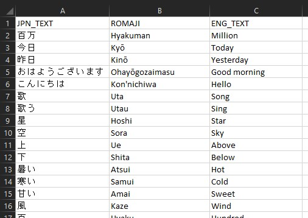
1. Select the *From a File* option. We will use the spreadsheet as the starting point.

    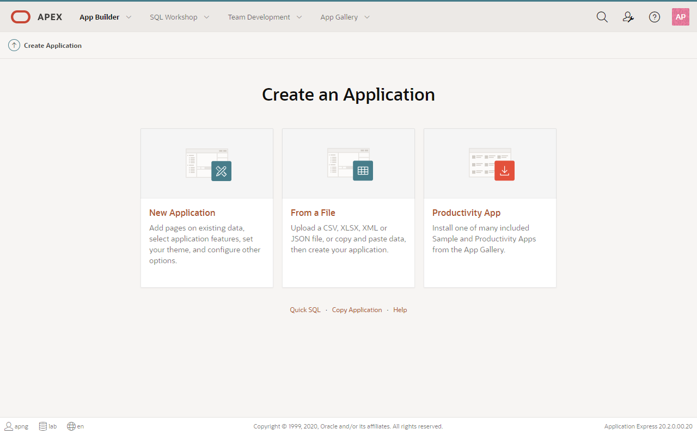
1. Drag and drop the CSV file containing the seed data.

    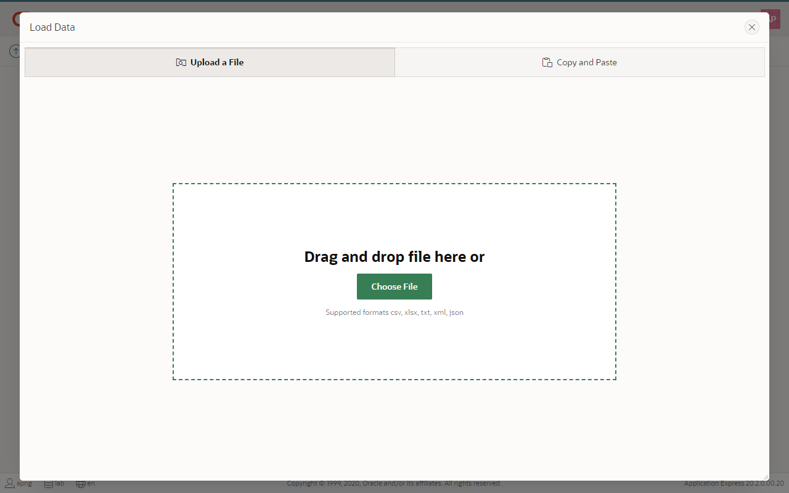
1. Enter a suitable name for your data and then click the *Configure* button.

    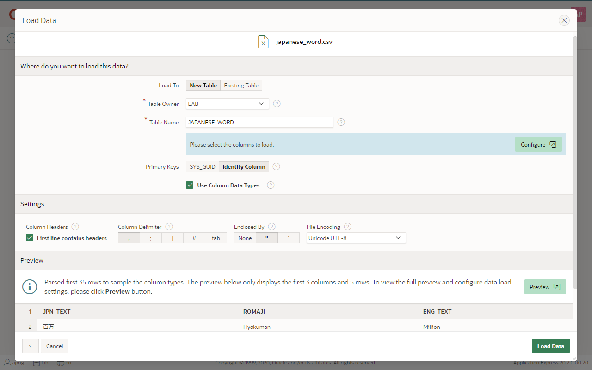
1. In this modal dialog, you can make any customizations to the database table that you are about to create, for example, the data type, the column name etc. Click *Save Changes* to save any customizations that you make.

    
1. When returned to the *Load Data* page, click the button *Load Data* to proceed with the import. The number of rows imported should tally with contents of the CSV file. If so, click *Create Application* for the final step.
1. In the next screen, you will have the opportunity to fine tune some settings before the application is created. You will notice that APEX has already added a few starting pages like the *Faceted Search* (if you are keen to know more, I wrote a more in-depth discussion on this topic [here](https://fuzziebrain.com/content/id/1917/)) and *Interactive Report* page. You may also introduce addition prefabricated features and change the *Authentication Scheme*. When you are done, click the *Create Application* button and the APEX engine will generate the application as defined.

    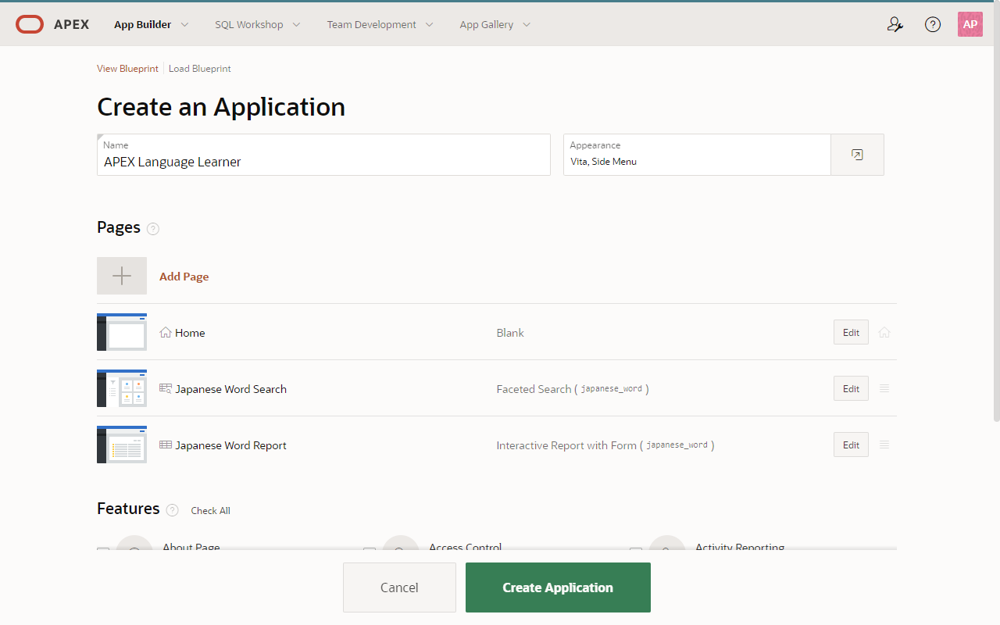

Once the application has been created, you will be returned to the App Builder with the new application open. Simply click the *Run Application* button to launch the application. APEX has security built-in and you will be required to login in order to use the application. Both authentication and authorization rules can be defined declaratively and usually does not require much coding. For example, APEX supports [OAuth2](https://oauth.net/2/) and you may choose to use this by creating and specifying a new Authentication Scheme called *Social Sign-In*. In my case, I chose to use Google accounts with a simple authorization rule that checks my email address before allowing access. If you like to learn more about setting up OAuth2 please see these articles on working with [Google](https://fuzziebrain.com/content/id/1709/) and [Azure AD](https://fuzziebrain.com/content/id/1908/).

In under an hour, you should have a functional web application that lets you:

1. List the words contained in the new table.

    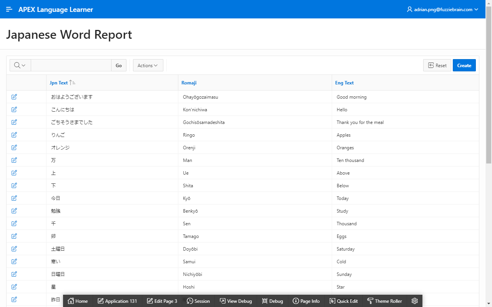
1. Create, modify or delete entries.

    

The default application user interface theme is also responsive and will be usable on mobile devices as well.


## Content Distribution

Unlike a mobile device such as an Apple iPad or Android phone, the M5Paper does not come with a web browser for rendering HTML from a web application to display dynamic content. It has to be programmed at a low level to display the information that you require. Since the ESP32 has networking capabilities, we are able to design a solution that pulls the needed data from a web service.

Oracle REST Data Services (ORDS) is a platform that would facilitate the creation of such web services. In the following steps below, you will learn how easy it is to create and publish a web service to be consumed by the embedded device.

1. Start by accessing the *RESTful Services* module in APEX:

    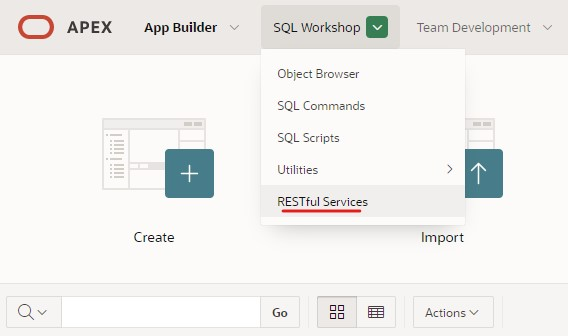
1. On the left pane, select the *Modules* node and then when the page loads, click the *Create Module* button on the top-right:

    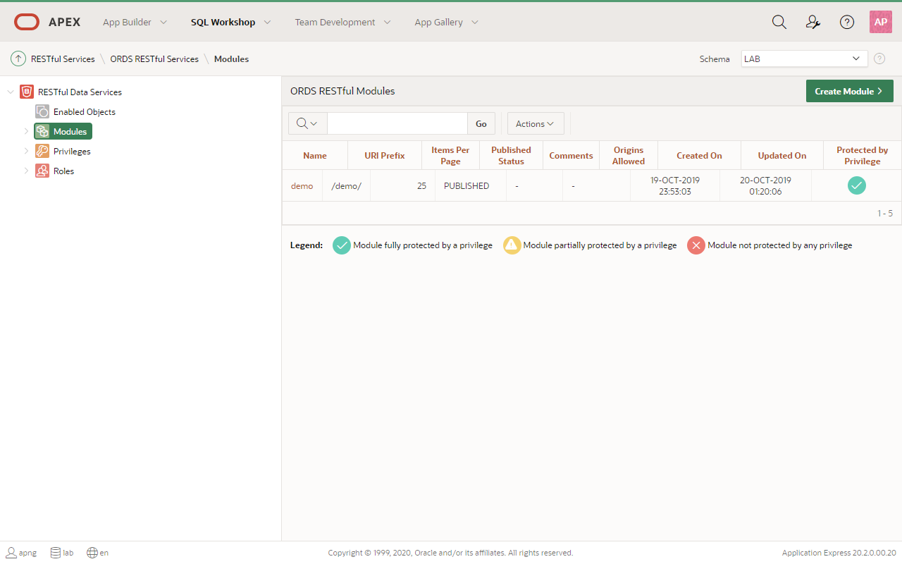
1. Enter the following details about the new module:

    **Module Name:** word  
    **Base Path:** /words

    Leave the remaining fields with their default values and then click the *Create Module* button to continue.

    
1. Once created, scroll down and then on the left, click the *Create Template* button:

    
1. Provide the following details about the template:

    **URI Template:** random  

    Leave the remaining fields with their default values and then click the *Create Template* button to continue.

    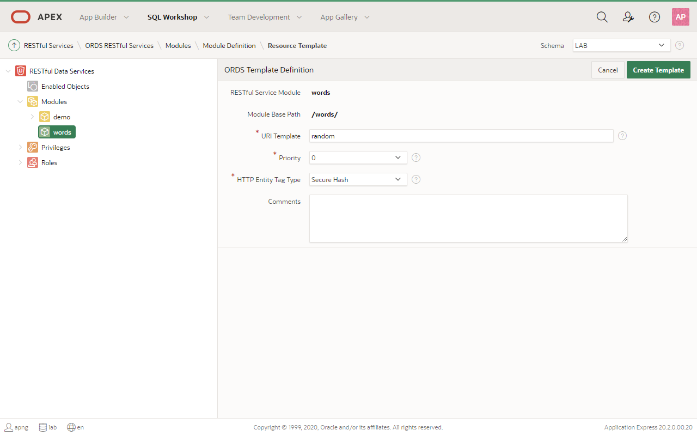
1. Scroll down again and then click the *Create Handler* button to create a *GET* handler for the template.

    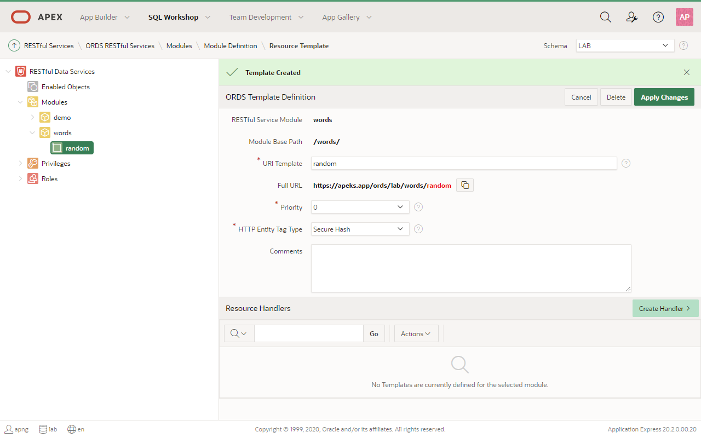
1. Ensure the following options are selected:

    **Method:** GET  
    **Source Type:** Collection Query

    

    In the *Source* field, enter the following SQL statement to perform a simple random selection of a single row:
    ```sql
    select *
    from (
        select jpn_text, romaji, eng_text
        from japanese_word
        order by dbms_random.normal()
    )
    fetch first 1 rows only
    ```

    > **IMPORTANT**
    >
    > Omit the semi-colon at the end of the statement.
1. Once the web service has been created, simply click the "Copy" button (underlined in red) to obtain the web service URL:

    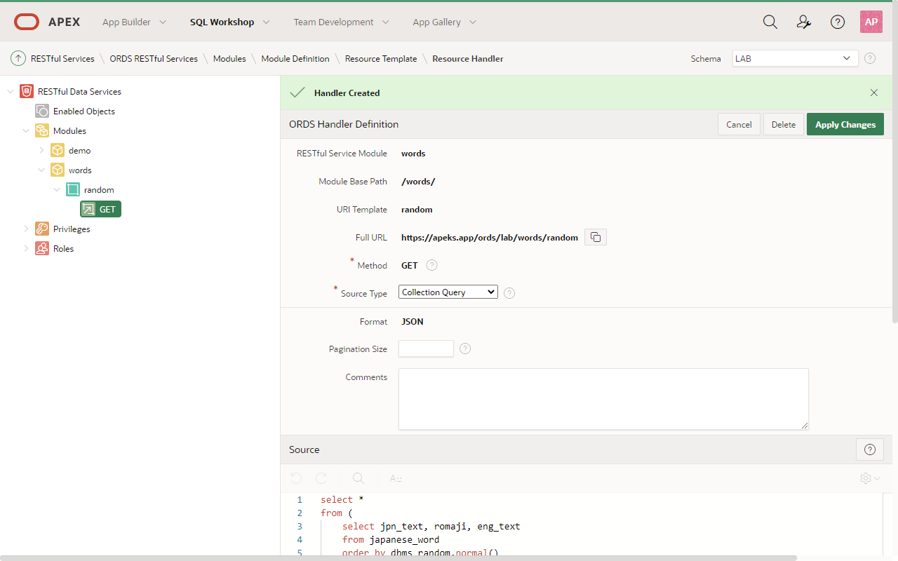

If you have access to a Bash shell and both *curl* and *json_pp* are available, run the following command to test the web service:
```bash
curl https://apeks.app/ords/lab/words/random | json_pp -json_opt utf8,pretty
```

You should get an output similar to this:
```bash
  % Total    % Received % Xferd  Average Speed   Time    Time     Time  Current
                                 Dload  Upload   Total   Spent    Left  Speed
100   347    0   347    0     0    896      0 --:--:-- --:--:-- --:--:--   896
{
   "count" : 1,
   "hasMore" : false,
   "items" : [
      {
         "eng_text" : "Friday",
         "jpn_text" : "金曜日",
         "romaji" : "Kin'yōbi"
      }
   ],
   "limit" : 25,
   "links" : [
      {
         "href" : "https://apeks.app/ords/lab/words/random",
         "rel" : "self"
      },
      {
         "href" : "https://apeks.app/ords/lab/metadata-catalog/words/item",
         "rel" : "describedby"
      },
      {
         "href" : "https://apeks.app/ords/lab/words/random",
         "rel" : "first"
      }
   ],
   "offset" : 0
}
```

Alternatively, test the web service by opening the URL in a web browser.

## Content Consumption and Display

As introduced earlier in the article, I decided to use the M5Paper for the display device for the following reasons and features:

1. The ESP32 chip used in the device is low-powered and has built-in WiFi support.
1. It comes with a relatively large sized e-paper display that does not require power to continuously display the same content.
1. The embedded RTC allows the device to power down into a "deep sleep" and then waking up on a predefined schedule.
1. It is powered by a large capacity lithium polymer battery.
1. The enclosure is sturdy and has magnets that I can use to attach to my fridge door.
1. Has a MicroSD slot that allows easy upload of resource files.
1. Multiple IO interfaces, buttons and an embedded temperature and humidity sensor for future extensions.
1. Inexpensive (for what it offers) at a price of $69 USD.

With the M5Paper, I have a choice of using either [Arduino](https://arduino.cc) or [MicroPython](https://www.micropyto).

### UIFlow

As with many ESP32-based products, the M5Paper supports both Arduino and MicroPython. M5Stack also provides their UIFlow firmware, which is based on MicroPython. It contains APIs that make working with compatible sensor products, and is easily programmable with their graphical Integrated Development Environment (IDE). Developers can choose to program the device using either the [Blockly](https://developers.google.com/blockly) interface, or straight up MicroPython.

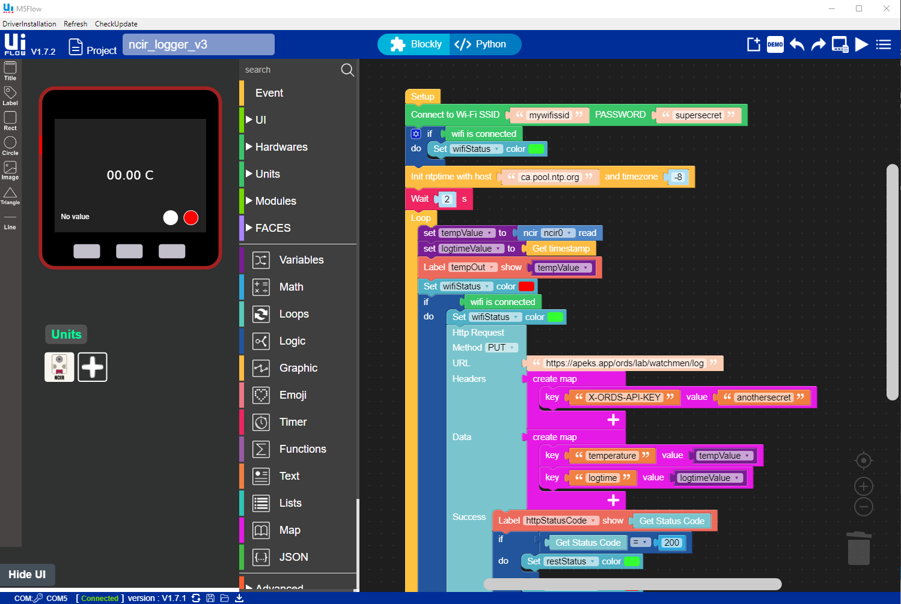

At the time of writing, the alpha version of the IDE supports and is certainly a great option to consider. Like APEX, it is designed for rapid application development!

While I like the "RADiness" of Blockly, I eventually decided to go with Arduino for two reasons. Firstly, the Arduino libraries appear to be more matured and better documented. The other reason was the ease of adding fonts to the application. As this is a multilingual application, I needed to use a font library that supported unicode characters and it was much easier and straightforward to do when programming with Arduino.

### Setup

Begin by downloading the latest the Arduino IDE from their [website](https://www.arduino.cc) and installing it on your computer.

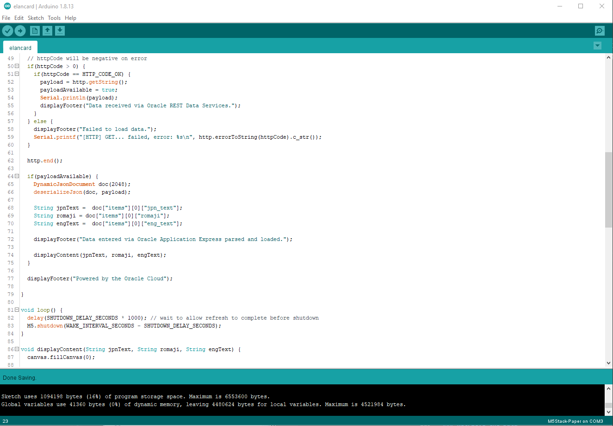

Besides writing code, the next two most commonly performed actions will involve these two buttons:


The button with the tick mark on the left is to compile and verify the code, while the button on the right with the right pointing arrow, both compiles and uploads the code to the connected device. However, before you can upload the code, the following configuration is required.

1. First, we need to add the board descriptions and required libraries to the Arduino IDE. Under the *File* menu, select the *Preferences* item, and then click the button next to the text field labelled *Additional Boards Manager URLS*. Enter the URL [https://m5stack.oss-cn-shenzhen.aliyuncs.com/resource/arduino/package_m5stack_index.json](https://m5stack.oss-cn-shenzhen.aliyuncs.com/resource/arduino/package_m5stack_index.json) and then click *OK*.

    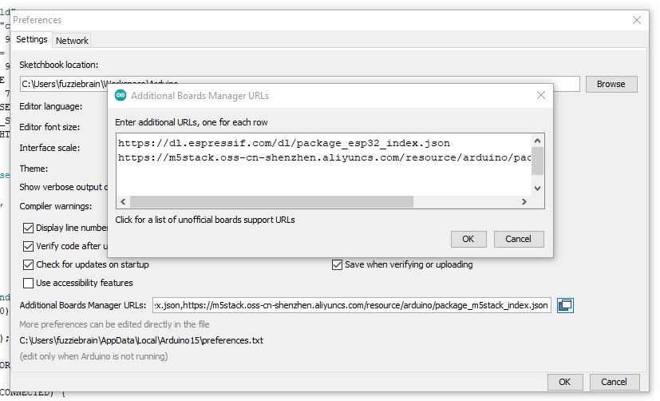
1. Return to the main window and then go the *Boards Manager* utility. You will find this under the *Tools* menu and when you place your mouse cursor over the currently selected *Board*, you will see an additional item called *Board Manager*. Launch the Board Manager and then search the term "m5stack". Install the *M5Stack* board by *M5Stack official*.
    
1. To work with JSON, we will also need a third-party library called [ArduinoJson](https://arduinojson.org/). We can install this using the *Library Manager* that can be accessed from under the *Tools* menu (the item is actually called *Manage Libraries...*).

    
1. Finally, select the *M5Paper* board. The preset parameter values should work, but you **must** select the communications port that is assigned to the device when connected *via* USB.
    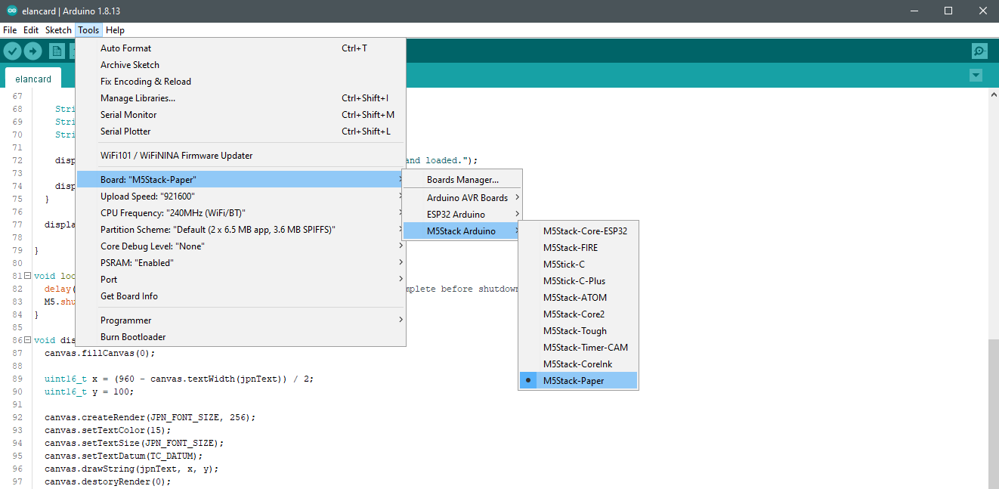

> **Note**
>
> For Windows, it may be necessary to install additional device drivers to successfully connect the device to your PC.

The code snippets in the remaining sections of this article are intended to highlight key points in the solution and should be read in the context of a larger piece of code. The complete source code I used for this project is published [here](https://gist.github.com/fuzziebrain/1fe0a548caa0e1a61d4cf7283c746400).

### Initialization

We begin by including the M5EPD library in the code. This library's code base is open sourced and is published in this GitHub [repository](https://github.com/m5stack/M5EPD). The company has also published the API documentation [here](https://docs.m5stack.com/#/en/arduino/arduino_home_page?id=m5paper_api) for reference.

The code below then performs some basic initialization steps:

```c++
#include <M5EPD.h>

M5EPD_Canvas canvas(&M5.EPD); // create the canvas

void setup() {

    M5.begin(); // Initialize the device
    M5.RTC.begin(); // Initialize the RTC
    M5.TP.SetRotation(0); // Set the orientation of the touch panel
    M5.EPD.SetRotation(0); // Set the orientation of the display
    M5.EPD.Clear(true); // Clears the screen content

    ...
}
```

### Internet Access

The ESP32 is Internet-ready, but to get connected, we will need to setup and initialize the WiFi connection. M5Stack provides the required library, so simply include that in your application and the following code for establishing the connection.

```c++
#include <WiFi.h>

const char SSID[] = "mywifissid";
const char WLAN_PASSWORD[] = "supersecret";

void setup() {}

    WiFi.begin(SSID, WLAN_PASSWORD);

    while (WiFi.status() != WL_CONNECTED) {
        delay(500);
        Serial.print("."); // print dots to the serial monitor to know that we are still waiting for a connection.
    }

    displayFooter("WiFi connected.");

    ...
}
```

### Retrieve the Data

Once connected, we will then require the ability to make the REST call using a suitable client that supports the HTTP protocol. Fortunately, the M5Stack boards also provide this dependency. Include the `HTTPClient` library (note the upper-cased "HTTP") and the third-party ArduinoJson library that we had installed earlier.

```c++
#include <HTTPClient.h>
#include <ArduinoJson.h>

HTTPClient http;
String payload;

setup() {

    http.begin("https://apeks.app/ords/lab/words/random");
    int httpCode = http.GET();

    // httpCode will be negative on error
    if(httpCode > 0) {
        if(httpCode == HTTP_CODE_OK) {
            payload = http.getString(); // get the HTTP response
            payloadAvailable = true;
            Serial.println(payload); // for debugging
            displayFooter("Data received via Oracle REST Data Services.");
        }
    } else {
        displayFooter("Failed to load data.");
        Serial.printf("[HTTP] GET... failed, error: %s\n", http.errorToString(httpCode).c_str());
    }

    http.end();

    // If the REST call was successful, parse the JSON content
    if(payloadAvailable) {
        DynamicJsonDocument doc(2048);
        deserializeJson(doc, payload);

        // Only one row should have been returned by the REST call.
        String jpnText =  doc["items"][0]["jpn_text"];
        String romaji = doc["items"][0]["romaji"];
        String engText =  doc["items"][0]["eng_text"];

        displayFooter("Data entered via Oracle Application Express parsed and loaded.");

        displayContent(jpnText, romaji, engText);
    }

    ...
}
```

### Display Words and Translations

With the backend interface done, let's now focus on the fun part, displaying the data! To display the Japanese characters, I needed a font that supports the appropriate code page. M5Stack has an example code that demonstrates the use of truetype fonts in M5Paper. The code demonstrates how to load and use the [Gensen font](https://github.com/ButTaiwan/gensen-font).

For convenience, I loaded the required `.ttf` (truetype font) file, which you can find in the [example code](https://github.com/m5stack/M5EPD/tree/main/examples/Basics/M5EPD_TTF), into the root partition of a freshly formatted MicroSD card with 256 MB storage capacity and loaded it into the single available slot. The code below then loads the font and creates the canvas:
```c++
void setup() {

    canvas.loadFont("/GenSenRounded-R.ttf", SD); // Load the font from the MicroSD card.
    canvas.createCanvas(960, 540); // Create the canvas with the maximum dimension of the e-paper in landscape orientation.

    ...
}
```

The code to render the display are divided into two functions, `displayContent` and `displayFooter`. There are three lines of text for rendering the Japanese characters, Romaji and English translations respectively. Text in all three lines are center-aligned, while the single line in the footer are left-aligned.

```c++
void displayContent(String jpnText, String romaji, String engText) {
    canvas.fillCanvas(0);

    uint16_t x = (960 - canvas.textWidth(jpnText)) / 2;
    uint16_t y = 100;

    canvas.createRender(JPN_FONT_SIZE, 256);
    canvas.setTextColor(15);
    canvas.setTextSize(JPN_FONT_SIZE);
    canvas.setTextDatum(TC_DATUM);
    canvas.drawString(jpnText, x, y);
    canvas.destoryRender(0);

    ...
}

void displayFooter(String text) {
    uint16_t x = 20;
    uint16_t y = SCREEN_HEIGHT - FOOTER_BAR_HEIGHT / 2;

    canvas.fillRect(0, SCREEN_HEIGHT - FOOTER_BAR_HEIGHT, SCREEN_WIDTH, FOOTER_BAR_HEIGHT, 15);
    canvas.createRender(24, 256);
    canvas.setTextSize(24);
    canvas.setTextColor(0);
    canvas.setTextDatum(CL_DATUM);
    canvas.drawString(text, x, y);
    canvas.destoryRender(0);

    canvas.pushCanvas(0, 0, UPDATE_MODE_DU);
}
```

There sixteen shades of grey available for use on the e-paper display, beginning with `0` for the lightest shade "white", and `15` as the maximum for black. Thus the main content is rendered with text in black on a white background, and the footer is in an inverted color scheme.

### Saving Power

It is evident that I am a huge fan of e-paper display technology. Its major advantage is that it can hold the displayed image even after it is powered down. For the electronic flashcard, I did not require real-time display of data or any interactivity with the buttons. I could therefore benefit from putting the device into a deep sleep after it has obtained and rendered the information on screen. This allows the device to run for a pretty long time before needing a recharge.

The code snippets below demonstrate how to power down the device and have it wake automatically after a predefined number of seconds.

```c++
const uint16_t WAKE_INTERVAL_SECONDS = 900; // 15 minutes
const uint16_t SHUTDOWN_DELAY_SECONDS = 1;

...
void loop() {
    delay(SHUTDOWN_DELAY_SECONDS * 1000); // wait to allow refresh to complete before shutdown
    M5.shutdown(WAKE_INTERVAL_SECONDS - SHUTDOWN_DELAY_SECONDS);
}
```

The `M5.shutdown` function is overloaded and provides developers with four different ways to shutdown and wake the device. Check out the API documentation for additional information.

### Compiling and Debugging

The final step is to compile the code and then uploading it to the M5Paper. To do this, ensure that the correct board and port are selected, and the device is plugged into an available USB port on your computer. If you need to debug the code, then be sure to open the *Serial Monitor* found under the *Tools* menu. Any calls like `Serial.println` would print the outputs to the Serial Monitor. When you are ready, click the *Upload* button or *Ctrl-U* and watch the outputs at the bottom of the IDE for any potential issues. If all goes well, the device will startup and perform the tasks you have programmed it to do.

## Summary

I am a fan of both APEX and M5Stack products for very similar reasons. They are easy to understand, develop and deploy a usable product in a short amount of time, and yet, allows for low-level extensibility should the need arises.

> *"It's not about our product, our company, our brand. It's not about how the user feels about us. It's about how the user feels about himself[/herself], in the context of whatever it is our product, service, cause helps him[/her] do and be."*
>
> Kathy Sierra  
> Badass: Making Users Awesome

I hope this simple but useful project will inspire you to build your own APEX applications with an IoT extension that interacts with the real world.

読んでくれてありがとう！

